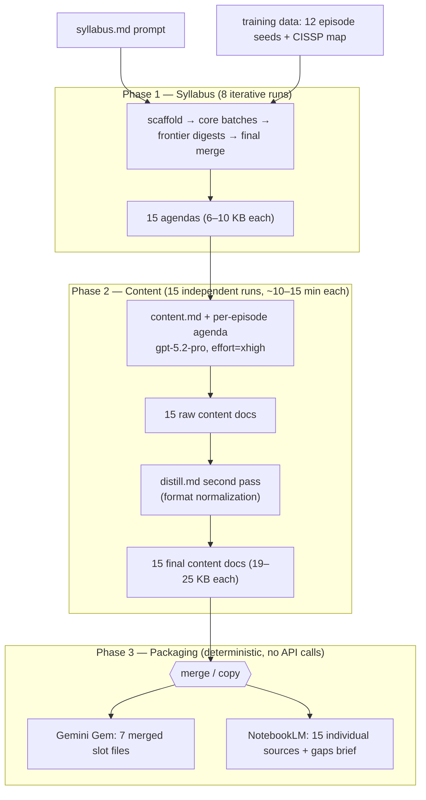
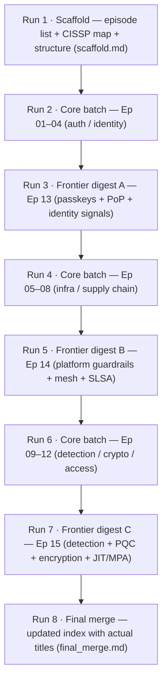
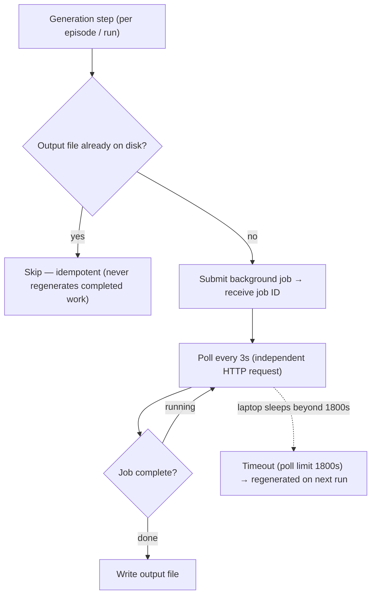

# Interview Prep Pipeline — Architecture Design

> **Originally authored February 2026** by Karsten. Converted PDF → Markdown on **2026-06-06** and
> verified against the live code the same day. **Status: historical snapshot** — the architecture below
> is still accurate, but some specifics have drifted since; see [Accuracy & drift](#accuracy--drift).
>
> Pipeline: `prep.py` · Model: gpt-5.2-pro (effort=xhigh) · Outputs (as of Feb 2026): 15 episodes · 321 KB content · 2 delivery targets.

> **Provenance:** body text and tables are reproduced faithfully from the source PDF (9 pages, no embedded
> images or vector graphics); the three Mermaid diagrams are **new** — they render flows the original only
> described in prose/tables. The PDF's one factual error (poll interval) is corrected here and noted in
> *Accuracy & drift*. Keep the original PDF alongside this file if you want the styled layout.

## Project Overview

This document describes the architecture of a Python pipeline that generates structured study materials
for Google L6 Staff Security Engineer interviews. The pipeline uses OpenAI's gpt-5.2-pro model to produce
15 episodes of deep technical content, then packages the output for two distinct delivery targets: a
Gemini Gem (interactive drill bot) and Google NotebookLM (AI-generated audio podcasts).

The system was designed to be resilient to network interruptions, support incremental runs, and produce
content dense enough to drive both conversational AI drilling and engaging podcast-style audio — all from
a single source of truth.

| Metric | Value |
|---|---|
| Episodes | 15 |
| Total content | 321 KB |
| Syllabus runs | 8 |
| Delivery targets | 2 |

## Problem Statement

Preparing for Staff-level security interviews requires mastering protocol-level details (RFCs, header
fields, crypto primitives) while simultaneously demonstrating architectural judgment (trade-off reasoning,
stakeholder alignment, failure-mode analysis). Existing study resources are either too shallow (blog posts)
or too broad (textbooks).

The pipeline solves this by generating structured, interview-targeted content at two complementary
modalities: text-based drilling (Gem) for active recall, and audio podcasts (NotebookLM) for passive
review during commutes and walks.

## Pipeline Architecture

The pipeline is a single Python script (`prep.py`, 22 KB) that orchestrates three generation phases, each
building on the output of the previous one. All phases use the same model and background polling pattern.



### Generation Phases

| # | Phase | Input | Output | Runs |
|---|-------|-------|--------|------|
| 1 | Syllabus | `syllabus.md` prompt + training data (12 episode seeds + CISSP map) | 15 agendas (6–10 KB each) | 8 iterative runs (scaffold → batches → frontier → merge) |
| 2 | Content | `content.md` prompt + per-episode agenda | 15 content docs (19–25 KB each) | 15 independent runs, ~10–15 min each |
| 3 | Packaging | 15 content docs | Gem files (7 merged) + NotebookLM files (15 individual) | Deterministic file copy/merge, no API calls |

## Syllabus Generation

The syllabus is generated across 8 sequential runs, each building on the previous outputs. This multi-pass
approach was necessary because a single prompt cannot reliably produce 15 coherent, non-overlapping episode
agendas with the required depth.



| Run | Purpose | Output | Episodes |
|-----|---------|--------|----------|
| Run 1 | Scaffold | Episode list + CISSP map + structure | `scaffold.md` |
| Run 2 | Core batch (Ep 1–4) | Full agendas for auth/identity episodes | Ep 01–04 |
| Run 3 | Frontier digest A | Passkeys + PoP + identity signals | Ep 13 |
| Run 4 | Core batch (Ep 5–8) | Full agendas for infra/supply chain | Ep 05–08 |
| Run 5 | Frontier digest B | Platform guardrails + mesh + SLSA | Ep 14 |
| Run 6 | Core batch (Ep 9–12) | Full agendas for detection/crypto/access | Ep 09–12 |
| Run 7 | Frontier digest C | Detection + PQC + encryption + JIT/MPA | Ep 15 |
| Run 8 | Final merge | Updated index with actual titles | `final_merge.md` |

## Content Generation

Each episode's content is generated independently using the content prompt (`content.md`, 9 KB) plus the
episode's agenda as input. The model runs at `effort=xhigh`, producing 19–25 KB of structured output per
episode in roughly 10–15 minutes of server-side processing. A second `distill.md` pass then normalizes raw
output into the final format (this is why total API runs include 15 distill runs — see *By the Numbers*).

### Episode Structure (7 Sections)

Every content document follows an identical 7-section format designed to support both interview drilling
and podcast generation:

| Section | Purpose |
|---------|---------|
| Title | Episode name with technical subtitle and as-of date |
| Hook | 3–5 bullets establishing the core tension and why this matters at Staff level |
| Mental Model | Single analogy that anchors the entire episode's reasoning |
| L4 Trap | Common junior mistake + why it fails at scale — the anti-pattern to avoid |
| Nitty Gritty | Deep technical detail: protocol fields, headers, crypto primitives, failure modes, coding hooks, interviewer probes |
| Staff Pivot | Architectural trade-off argument: 3 competing approaches, decisive choice, metrics, risk acceptance, stakeholder alignment |
| Scenario Challenge | Constraint-based problem with incident twists, multi-team dynamics, and an evaluator rubric |

### Micro-Prefix Cues

Content documents use structured prefix cues that signal to both the Gem and the podcast hosts what kind
of interaction each bullet demands:

| Prefix | Target / Ep | Function |
|--------|-------------|----------|
| `Probe:` | 3–5 | Interviewer question — Gem uses for drilling; podcast hosts use for debate |
| `Coding hook:` | 5–10 | Implementation detail with test requirement — code-level depth signal |
| `Red flag:` | 4–6 | Anti-pattern to recognize and avoid — shows awareness of common failures |
| `Anchor:` | 3–6 | Key term/concept to remember — serves as a memory hook |
| `Tie-back:` | 1–3 | Interview behavioral question — connects technical knowledge to personal experience |

## Resilience Design



### Background Polling

The pipeline uses OpenAI's Responses API in background mode. Each generation is submitted as a server-side
job, and the script polls with independent HTTP requests (`time.sleep(3)` in the poll loop — see *Accuracy
& drift*; the original PDF said 30 s). This design was chosen specifically because content generation takes
10–15 minutes per episode, and the pipeline must survive laptop sleep/wake cycles and network interruptions.

How it works: the script submits a job and receives a job ID. It then enters a polling loop where each
check is a new, independent HTTP request. If the laptop sleeps, polling pauses; when it wakes, the next
poll fires with the same job ID. The job continues running at OpenAI regardless of client state.

### Skip Logic

Every generation step checks for existing output files before starting. If a content file exists on disk,
that episode is skipped. This means the pipeline is fully idempotent — running the same command multiple
times never regenerates completed work.

Timeout recovery: the poll timeout is 1800 seconds. If a laptop sleeps longer than that, `time.time()`
jumps forward on wake and triggers a timeout error. The failed episode simply gets regenerated on the next
run, since the skip logic only checks for output files, not job state.

### Incremental Runs

The primary command (`python prep.py all`) handles the entire pipeline end-to-end. It runs syllabus
generation, content generation, and packaging in sequence. At each step it skips anything that already has
output on disk, so you can interrupt and resume at any point without losing work.

## Delivery Targets

### Gemini Gem (Interactive Drill Bot)

The Gem receives content merged into slot-sized files (40–69 KB each) optimized for Gemini's context
window. Episodes are paired by theme:

| Slot | Content | Size |
|------|---------|------|
| gem-0 | Syllabus scaffold + final merge (how-to guide + CISSP map) | 15 KB |
| gem-1 | Ep 1–2: Token binding + Session revocation | 45 KB |
| gem-2 | Ep 3–4: Mobile OAuth + Passkeys | 40 KB |
| gem-3 | Ep 5–6: BeyondCorp + Workload identity | 44 KB |
| gem-4 | Ep 7–8: SSRF defense + Supply chain | 40 KB |
| gem-5 | Ep 9–10: Detection engineering + Crypto agility | 42 KB |
| gem-6 | Ep 11–12: Envelope encryption + JIT/MPA | 44 KB |
| gem-7 | Ep 13–15: Frontier digests A, B, C | 69 KB |
| Resume | Candidate's resume PDF | — |
| Gaps brief | IAL3 + DDoS/Anycast + Behavioral biometrics | 22 KB |

The Gem functions as an active-recall drill bot. It reads the content docs and uses the structured cues
(`Probe:`, `Coding hook:`, `Tie-back:`) to generate targeted interview questions, challenge answers, and
simulate interviewer follow-ups.

### NotebookLM (Audio Podcasts)

NotebookLM receives the same 15 content files as individual source documents, plus a gaps brief as a 16th
source. Each podcast episode is generated with a custom prompt composed of two parts:

- **Per-episode frame:** 3 fields (Format, Central argument, Stakes) that give NotebookLM a dramatic
  situation to perform, not just a topic to discuss.
- **Generic prompt:** host personalities, narrative structure rules, audio pacing guidelines, and
  instructions for disagreement, open loops, and unresolved endings.

#### Podcast Format Distribution

Episodes are assigned to 5 dramatic formats, distributed across the listening order so no two consecutive
episodes share the same format:

| Format | Count | Episodes |
|--------|-------|----------|
| P0 Incident Postmortem | 4 | Ep 2 (Revocation), 7 (SSRF), 9 (Detection), 12 (Insider) |
| Architecture Debate | 3 | Ep 1 (mTLS/DPoP), 6 (Workload ID), 11 (Encryption) |
| Migration War Story | 3 | Ep 4 (Passkeys), 5 (BeyondCorp), 10 (PQC) |
| Failure Autopsy | 3 | Ep 3 (Mobile OAuth), 8 (Supply Chain), 15 (Frontier C) |
| Design Review | 2 | Ep 13 (Frontier A), 14 (Frontier B) |

## Episode Curriculum

The 15 episodes cover the full identity and security infrastructure stack, from client-facing
authentication through infrastructure defense to organizational controls:

| Ep | Title | Domain |
|----|-------|--------|
| 01 | mTLS vs DPoP: Sender-Constrained Tokens | Token Security |
| 02 | Event-Driven Revocation (CAEP/RISC) | Session Management |
| 03 | Mobile OAuth: Confused Deputies | Client Security |
| 04 | Passkeys (WebAuthn) Rollout | Authentication |
| 05 | BeyondCorp: Zero-Trust Proxy | Network Architecture |
| 06 | ALTS: Workload Identity mTLS | Service Mesh |
| 07 | SSRF → Cloud Metadata Defense | Infrastructure |
| 08 | SLSA Provenance + Deploy Verification | Supply Chain |
| 09 | Detection Engineering: Detections-as-Code | Detection & Response |
| 10 | Crypto Agility: Hybrid TLS + Post-Quantum | Cryptography |
| 11 | Envelope Encryption: Key Hierarchy | Data Protection |
| 12 | JIT + Multi-Party Authorization | Access Control |
| 13 | Frontier A: PoP + Signals + Passkeys | Integration Review |
| 14 | Frontier B: Platform Guardrails | Integration Review |
| 15 | Frontier C: Detection + PQC + Keys + MPA | Integration Review |

## Prompt Architecture

The pipeline uses three prompt files, each targeting a different generation phase:

| Prompt | Size | Role |
|--------|------|------|
| `syllabus.md` | 14 KB | Generates episode agendas with 12 seed topics, CISSP domain coverage, and a 7-section template. Runs 8 times across scaffold/batch/frontier/merge phases. |
| `content.md` | 9 KB | Generates per-episode content from the agenda. Enforces the 7-section format, micro-prefix cues (Probe, Coding hook, Red flag, Anchor, Tie-back), and Staff-level depth. |
| `distill.md` | 4 KB | Post-processes raw content into final format. Handles minor formatting normalization. Runs as a second pass on each episode. |

### NotebookLM Prompt (Separate)

The NotebookLM prompt was developed independently through a 6-lens iterative refinement process. It is not
part of the pipeline script — it's pasted manually into NotebookLM's instruction field alongside each
episode's frame. The 6 evaluation lenses used during prompt development were: retention and
re-listenability, NotebookLM capabilities and limitations, differentiation from source material, cognitive
load for audio listeners, prompt economics (word budget), and cross-episode consistency.

## File Structure

> Point-in-time layout from the original doc. The live repo has since grown (e.g. a `profiles/` directory
> for multiple domains, and additional prompts such as `gem.md`, `intake.md`, `notebooklm.md`).

```
interview-prep/
  prep.py              # Pipeline orchestrator (22 KB)
  README.md            # Project documentation
  prompts/
    syllabus.md        # Syllabus generation prompt
    content.md         # Content generation prompt
    distill.md         # Post-processing prompt
  inputs/              # Raw materials
    agendas/           # Seed topic data
    episodes/          # Pre-existing content (if any)
    misc/              # External docs for gem-8
  outputs/
    episodes/          # 15 content docs (source of truth)
    raw/               # Unprocessed content + syllabus runs
    syllabus/          # 15 agendas + scaffold + merge
    gem/               # Merged files for Gemini (10 slots)
    notebooklm/        # Individual files for podcasts (16)
    manifest.txt       # Build manifest with sizes + checksums
```

## Gap Analysis

After generating all 15 episodes, a gap analysis was performed by cross-referencing the full content corpus
against the target topic list. Three gaps were identified and addressed with a supplementary gaps brief:

| Gap | Why It Matters | Status |
|-----|----------------|--------|
| IAL3 / Identity Proofing | Trust anchor — everything downstream of a fraudulent account is compromised | Covered in gaps brief |
| Global DDoS / Anycast | Availability threat that bypasses all identity controls | Covered in gaps brief |
| Behavioral Biometrics | Post-auth signal layer for continuous trust scoring | Covered in gaps brief |
| Signature Counters | WebAuthn `signCount` handling for fraud detection | Already in Ep 4 |

## By the Numbers

| Metric | Value |
|--------|-------|
| Total content generated | 321,435 bytes across 15 episodes |
| Model | gpt-5.2-pro (effort=xhigh) |
| Avg generation time per episode | ~12 minutes (server-side) |
| Total API runs | 8 (syllabus) + 15 (content) + 15 (distill) = 38 |
| Gem upload slots used | 10 of 10 |
| NotebookLM source docs | 16 (15 episodes + 1 gaps brief) |
| Podcast formats | 5 (P0, debate, migration, autopsy, review) |
| Micro-prefix cues per episode | ~20 (Probe + Coding hook + Red flag + Anchor + Tie-back) |
| Preparation timeline | Pipeline built + run in ~18 hours |
| Days before first interview | 5 |

## Accuracy & drift

This document was **authored February 2026** and describes the pipeline as it stood then. The Markdown
conversion (2026-06-06) is faithful to the original PDF; on the same date its claims were checked against
the live `prep.py` and prompt files. **Status: historical snapshot** — the architecture mechanics above are
still accurate, but some specifics have drifted:

| Item | This doc (Feb 2026) | Current code (verified 2026-06-06) |
|------|---------------------|------------------------------------|
| Poll interval | 30 s → **corrected to 3 s** | `time.sleep(3)` in the poll loop |
| `prep.py` size | 22 KB | ~62 KB |
| `syllabus.md` size | 14 KB | ~6 KB (the 12 seeds + CISSP map moved into per-profile `domain/` files) |
| Scope | single domain (Google L6 security, 15 episodes) | multi-profile: `init` / `setup --profile`; `profiles/` = security-infra, sre, tpm, …; episode counts env-configurable (`PREP_CORE_EPISODES`, `PREP_FRONTIER_EPISODES`) |

**Verified accurate as of 2026-06-06:** model + `effort=xhigh`, background-mode polling via the Responses
API, the 1800 s poll timeout, the three phases + `prep.py all`, skip-if-exists idempotency, the
12-core + 3-frontier = 15 episode structure, the 7-section content format, and the five micro-prefix cues.

**Corrected error:** the source PDF stated the poll interval as 30 s; the code polls every 3 s
(`time.sleep(3)`). Corrected in the prose and in the pipeline/resilience diagrams above.

This file is a point-in-time record. For current behavior, the source of truth is `prep.py` and the files
under `prompts/` and `profiles/`.

---

*Built with Claude + GPT-5.2-Pro + Gemini + NotebookLM.*
